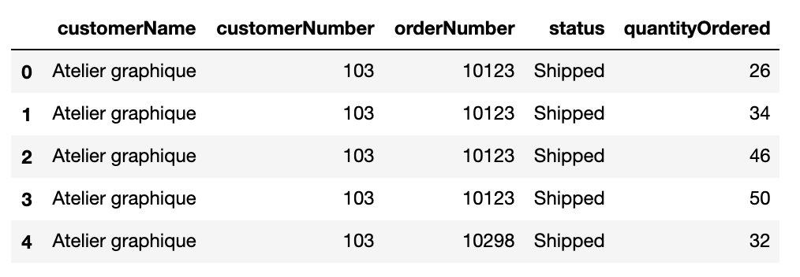
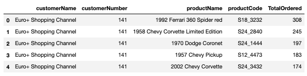
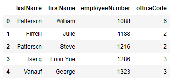

# More Practice With SQL Queries - Lab

## Introduction

In this lesson, we'll run through some practice questions to refresh your knowledge of SQL Queries!

## Objectives

You will be able to:

- Use `GROUP BY` statements in SQL to apply aggregate functions like: `COUNT`, `MAX`, `MIN`, and `SUM`
- Decide and perform whichever type of join is best for retrieving desired data
- Use the `HAVING` clause to compare different aggregates
- Write subqueries to decompose complex queries

## Getting Started

As in previous labs, we'll make use of the `sqlite3` library as well as Pandas. By combining them, we'll be able to write queries as Python strings, and make sure that the results are always returned as a Pandas DataFrame. 

We'll start by loading both libraries and connecting to the database we'll be using for this lab, `data.sqlite`. You may remember this database from a previous lab. As a refresher, here's the ERD diagram for this database: 


In the cell below:

* Import the necessary libraries `pandas` and `sqlite3` 
* Establish a connection to the database `data.sqlite` 
* Get the `cursor` from the connection and store it in the variable `c` 


```python

```

## Basic Queries

Now, let's review basic SQL queries. In the cell below:

Write a query that gets the first name, last name, phone number, address, and credit limit for all customers in California with a credit limit greater than 25000.00. 


```python
# For the first query, the boilerplate for getting 
# the query into a DataFrame has been provided for you
c.execute(""" """)
df = pd.DataFrame(c.fetchall())
df.columns = [x[0] for x in c.description]
df
```

#### Expected Output


## Aggregate Functions and GROUP BY

Next, write a query that gets the average credit limit per state.


```python

```

#### Expected Output


## JOINs

Now, write a query that uses JOIN statements to get the customer name, customer number, order number, status, and quantity ordered. Print only the head of this DataFrame. 


```python

```

#### Expected Output

 

## HAVING and ORDER BY

Now, return the customerName, customerNumber, productName, productCode, and total number ordered for any product a customer has bought 10 or more of cumulatively. Sort the rows in descending order by the quantity ordered. 

**_Hint_**: For this one, you'll need to make use of HAVING, GROUP BY, and ORDER BY -- make sure you get the order of them correct!


```python

```

#### Expected Output



## Subqueries

Finally, get the first name, last name, employee number, and office code for employees from offices with less than 5 employees. Print the first five rows of this DataFrame. 


```python

```

#### Expected Output



# Summary

In this lesson, we reviewed all the major concepts and keywords associated with SQL queries!
